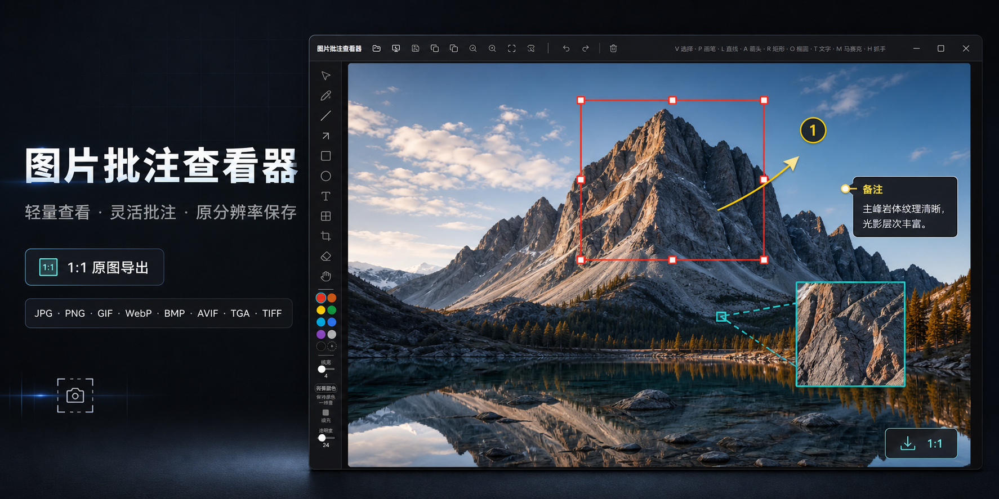
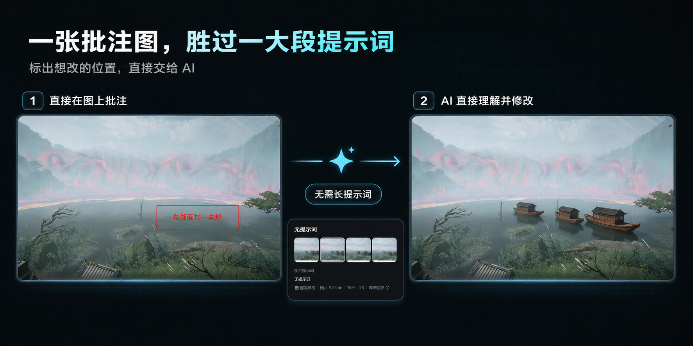

# 图片批注查看器 PictureViewer



**PictureViewer 是一款轻量、易用的图片查看与批注工具**，支持 JPG、PNG、GIF、WebP、BMP、AVIF、TGA、TIFF 等主流格式。可快速添加文字、箭头、矩形、画笔等批注，并以原始分辨率导出，避免截图造成的画质损失。批注内容还可直接作为视觉提示交给 AI 生图工具，让 AI 理解修改位置和需求，无需编写冗长提示词。同时支持截图，适合设计沟通、问题反馈、图片审阅和 AI 创作等场景。



## 功能亮点

- **多格式打开**：JPG / PNG / GIF / WebP / BMP / AVIF 原生解码；**TGA**（自研解码器，type 2/10 真彩 + type 3/11 灰度，含 RLE）；**TIFF**（utif）
- **四种打开方式**：文件对话框 / 拖拽入窗 / Ctrl+V 粘贴剪贴板 / **一键截图**（截取屏幕或窗口自动载入）
- **流畅查看**：滚轮以光标为中心缩放（2%–6000%）、空格/抓手平移、适应窗口、100% 实际大小
- **对象化批注**：画笔、直线、箭头、矩形、椭圆、文字（双击编辑）、马赛克——全部可选中、移动、缩放、旋转、改色、删除
- **裁剪与橡皮擦**：拖框裁剪（可撤销）、对象橡皮擦（划过即删，一步撤销）
- **50 步撤销/重做**：Ctrl+Z / Ctrl+Shift+Z
- **原图分辨率导出**：PNG 无损 / JPEG（质量可调）；**一键复制 PNG 到剪贴板**（Ctrl+Shift+C）；Chrome/Edge 支持系统「另存为」对话框；无批注时可用作格式转换（TGA/TIFF → PNG）
- **全中文深色专业界面**，完整快捷键（V/P/L/A/R/O/T/M/E/C/H 等）

## 快速开始

**最简单的方式（Windows）**：双击项目根目录的 `启动图片批注查看器.bat` 即可——它会自动检查 Node.js、首次运行自动安装依赖、自动挑选空闲端口（3000-3009）并打开浏览器。使用期间保持窗口打开，**关闭窗口即停止服务**。

**命令行方式**：

```bash
npm install        # 安装依赖（Node.js 20+）
npm run dev        # 开发模式，默认 http://localhost:3000
npm run build      # 生产构建 → dist/
npm run preview    # 预览构建产物
```

> Windows + Git Bash 下若 `npm` 不可用，请使用 `npm.cmd`。

## 文档索引

- [安装部署文档](docs/INSTALL.md) — 环境要求、安装步骤、静态部署（含 Nginx 配置）、常见问题
- [使用说明](docs/USER-GUIDE.md) — 完整功能介绍、快捷键表、FAQ
- [交接文档](docs/HANDOFF.md) — 技术栈、目录结构、核心架构决策、已知限制、扩展方向
- [启动器开发与验收规范](docs/LAUNCHER-CHECKLIST.md) — 修改启动器 bat 的编写纪律与验收流程（配 `scripts/verify-launcher.py` 自动化）

## 测试图片

`test-images/` 内含 5 张 960×640 测试图（渐变 + 几何图形）：`sample.png`、`sample.tga`（24bpp）、`sample-rle.tga`（RLE）、`sample-32bpp.tga`（带 alpha）、`sample.tiff`。可用 `python test-images/gen_test_images.py` 重新生成（需 pillow）。

## 技术栈

React 19 + TypeScript + Vite 7 + Tailwind CSS + shadcn/ui + fabric.js（批注层）+ utif（TIFF），TGA 为内置纯 TS 解码器。纯前端应用，所有处理在浏览器本地完成，不上传任何图片。
